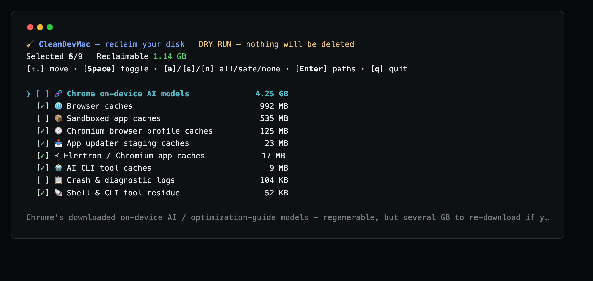

# CleanDevMac

English | [العربية](README.ar.md) | [Español](README.es.md) | [日本語](README.ja.md) | [简体中文](README.zh-CN.md) | [繁體中文](README.zh-TW.md)

[](https://github.com/cleandevmac/cdm/releases)
[](https://github.com/cleandevmac/cdm/releases/latest)
[](https://github.com/cleandevmac/cdm/stargazers)
[](LICENSE)
[](https://github.com/cleandevmac/cdm)
[](https://www.paypal.com/paypalme/hoangnc)

**CleanDevMac** — `cdm` on your command line — is a terminal UI that finds the dev caches, build artifacts and leftover app data eating your disk, shows you exactly what and how big, and deletes only what you tick.

The downloads badge counts fetches of the `cdm` release asset. Every `curl` install below hits that asset, so it is the real usage counter for this tool.

Site: **<https://cleandevmac.github.io>**

macOS only. Pure bash, no dependencies. Zero telemetry — the only network call `cdm` ever makes is fetching its own rule JSON.

## Run it

```bash
curl -sSL https://github.com/cleandevmac/cdm/releases/latest/download/cdm | bash
```

There is no install step. The script runs straight from the pipe, scans, and hands you the TUI. When it exits, nothing of it is left on your Mac.

Dry run first — scans and reports, deletes nothing:

```bash
curl -sSL https://github.com/cleandevmac/cdm/releases/latest/download/cdm | bash -s -- -n
```

## Keep it around (optional)

Only do this if you want to run `cdm` again without the URL. It is the one thing here that does leave a file behind:

```bash
mkdir -p ~/.local/bin
curl -sSL https://github.com/cleandevmac/cdm/releases/latest/download/cdm -o ~/.local/bin/cdm
chmod +x ~/.local/bin/cdm
cdm
```

Make sure `~/.local/bin` is on your `PATH` (`export PATH="$HOME/.local/bin:$PATH"` in your shell rc). Re-run the `curl -o` line to update. To uninstall: `rm ~/.local/bin/cdm`.



## What it cleans

**1. Dev caches & build artifacts** — Xcode DerivedData and DeviceSupport, Go build & module cache, npm/npx/pnpm/yarn, JS build tools (Turbo, Vite, webpack, Parcel, ESLint), Gradle, Maven, sbt/Ivy, Cargo, Python (pip, uv, poetry, ruff, mypy), Ruby/Bundler, Bun, Deno, CocoaPods, SwiftPM, Composer, Bazel, Zig, cloud CLIs (kubectl, AWS, gcloud, Azure), Docker buildx, JetBrains, Playwright, and the Homebrew download cache.

**2. Electron, browser & app caches** — VS Code, Claude, Slack; Chrome, Brave, Edge, Vivaldi and Arc scanned per browser profile; Firefox; and crash/telemetry SDK caches (Sentry, Crashlytics, Sparkle).

**3. Project junk, grouped per repo** — `node_modules`, `dist`, `build`, `target`, `__pycache__`, and git-ignored files. Off by default; pass `-p` to enable it. Interactive runs offer it after the cache scan finishes.

**4. Docker / Podman** — `system prune -af`, opt-in. Named volumes are never touched.

**5. Orphaned app data** — Application Support, Caches and Preferences belonging to apps that are no longer installed.

## Safety

- **Nothing is deleted without an itemized confirmation.** You see the plan and the sizes, then type `y`.
- **Caches are deleted permanently** — they regenerate on the next build.
- **Orphaned app data and git-ignored files go to the Trash**, so they are recoverable.
- **Never touched regardless of what the rules say:** `~/Documents`, `~/Desktop`, `~/Downloads`, `~/Pictures`, `~/.ssh`, and iCloud Drive. This guard sits below the rule engine — a rule cannot opt out of it.
- **App sandboxes and Apple/system-owned data are never touched.**
- The installed-app list is read from **LaunchServices**, so prefPanes, plugins and other non-`.app` bundles aren't mis-flagged as orphaned.
- `--dry-run` deletes nothing.
- Every run is logged to `~/.cleandevmac/clean.log`.

## TUI keys

| Key | Action |
| --- | --- |
| `↑` / `↓`, `k` / `j` | Move |
| `Space` | Toggle the selected item |
| `a` / `s` / `n` | Select all / safe defaults / none |
| `Enter` (or `d`) | Show the exact paths and sizes behind an item |
| `c` | Clean — builds an itemized plan, confirm with `y` |
| `q` (or `Esc`) | Quit |

Items are sorted biggest-first. Safe regenerable caches are pre-selected; the Maven repository, Playwright browsers, crash logs, project folders and orphaned app data all start unchecked — `s` resets to that default selection.

## Editable rules

Targets live in JSON under `rules/`, not in code. Add or remove paths by editing these files:

| File | Contents |
| --- | --- |
| `index.json` | Manifest — which rule files load, and in what order |
| `dev-caches.json` | Dev caches & build artifacts |
| `app-caches.json` | Electron, browser & app caches |
| `containers.json` | Docker / Podman |
| `project-junk.json` | Per-repo project junk |
| `orphans.json` | Orphaned app data detection |

Each category is an object with `icon`, `name`, `desc`, `paths`, `default` (pre-selected or not) and `method` (`rm` to delete, `trash` to move to the Trash). Point `cdm` at your own set with `--patterns <dir-or-url>`.

## Options

| Option | Effect |
| --- | --- |
| `-n`, `--dry-run` | Scan and report; delete nothing |
| `-y`, `--yes` | Non-interactive: clean the pre-selected safe caches, then exit. Never touches project folders, orphaned app data, or the Trash |
| `-p`, `--projects` | Also scan code repos for project junk |
| `--patterns SRC` | Load rules from a local directory or a base URL |
| `--no-color` | Disable ANSI color |
| `-h`, `--help` | Usage |

## Environment

| Variable | Effect |
| --- | --- |
| `CDM_REMOTE` | Base URL rules are fetched from when no local copy is found |
| `CDM_PATTERNS` | Rule source — a local directory or a base URL (same as `--patterns`) |

## Support

cdm is free and MIT, and it stays that way — no paid tier, no telemetry, nothing held back. If it gave you your disk back and you feel like buying me a coffee:

**[paypal.me/hoangnc](https://www.paypal.com/paypalme/hoangnc)**

Starring the repo or telling another developer about it helps just as much.

## Credits

Some cache locations were cross-checked against other open-source macOS cleaners:

- [PureMac](https://github.com/momenbasel/PureMac) — MIT
- [mac-cleaner-cli](https://github.com/guhcostan/mac-cleaner-cli) — MIT
- [mac-cleanup-go](https://github.com/2ykwang/mac-cleanup-go) — MIT
- [mac-cleanup-py](https://github.com/mac-cleanup/mac-cleanup-py) — Apache-2.0

The rules here are written independently for this tool's own schema, and each path was verified before being added.

## License

MIT — see [LICENSE](LICENSE).
